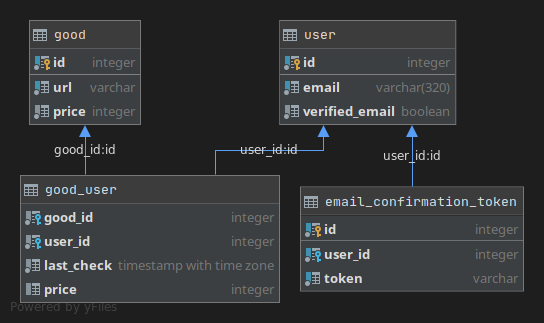

### [Задача -  реализовать сервис, позволяющий следить за изменением цены любого объявления на Авито](https://github.com/avito-tech/bx-backend-trainee-assignment)

Сервис реализован на `Golang` и `PostgreSQL`.
А в качестве драйвера для `postgresql` использовал [pgx](https://github.com/jackc/pgx) и [sqlx](https://github.com/jmoiron/sqlx).
Спасибо за [это видео](https://www.youtube.com/watch?v=Uojy57I-xP0)
Из-за хорошей защиты от парсинга, было принято решение использовать [selenium](https://www.selenium.dev/ "selenium").

Под "хорошей защитой от парсинга я подразумеваю", что какие бы `HTTP` заголовки не ставил, под какое устройство бы не маскировался бы - получаю 403 код.

Возможности:
1. Подписка/отписка на изменение цены, с уведомлением на email.
2. Ручная проверка изменения цена (для пользователей с подтвержденным email) 

### Также есть отдельный телеграмм-бот вариант.
## Запросы:
#### 1) Subscribe (POST /subscribe):
Пример запроса:

    curl --request POST \
      --url http://127.0.0.1:8080/subscribe \
      --header 'content-type: application/json' \
      --data '{
    	"goodURL": "https://www.avito.ru/moskva/avtomobili/ford_f-150_2019_1507701034",
    	"email": "kxsyxsdl@firste.ml"
    }'
Сначала идет десериализация и валидация тела запроса:
```go
DB := DBModule.GetDB()
	var params models.SubscribeParams
	err := json.NewDecoder(request.Body).Decode(&params) // заполняю структуру с параметрами запроса
	if err != nil {
		responses.Status(response, http.StatusPreconditionFailed)
		return
	}
	err = params.Validate()
	if err != nil { // если параметры не прошли валидацию, отправлю 412 код
		responses.Error(response, http.StatusPreconditionFailed, err)
		return
	}
```
Модель `SubscribeParams`
```go
type SubscribeParams struct {
	GoodURL string `json:"goodURL"`
	Email   string `json:"email"`
}
```
После вызывается функция `checkPriceByURL()`, которая возвращает цену и сообщение об ошибке. В функции открывается новая вкладка и переход на страницу, дальше происходит проверка на существование страницы и парсинг цены и заголовка объявления (нужно для уведомления на email).

Если все прошло успешно начиная транзакция и вызов хранимой функции `subscribe(email_in := $1, good_url_in := $2, price_in := $3)`. 
Для каждого возможного случая (подписка уже есть, товар зарегистрирован, а пользователь нет) есть свое сообщение которое функция возвращает. Если был зарегистрирован новый пользователь, формируется токен формата `UUID4` , и отправляется на email пользователю. (Для работы с почтой использовалась стандартная go библиотека - smtp). Транзакция нужна для того, чтобы если на этапе создания токена (в случае регистрации нового пользователя) произошла ошибка, то пользователя не регистрировать, так как с системой что-то не то.

#### 2) EmailConfirmation (GET /confirm_email):
Пример запроса:
```bash
curl --request GET \
  --url 'http://127.0.0.1:8080/confirm_email?token=4feb3aaf-796a-4766-8eb6-2a46a5a11d2f'
```
Вызывается хранимая процедура в которую передается токен, если такого токена нет - возвращается `404 HTTP` код. Если есть, то меняет поле `verified_email` на `true` нужному пользователю.

#### 3) GetSubscribes (GET /get_subscribes):
Пример запроса:
```bash
curl --request GET \
  --url 'http://127.0.0.1:8080/get_subscribes?email=mail%40gmail.com' \
  --header 'content-type: application/json' \
}'
```
По идеи эта функция должны вызывается только после успешной авторизации (но авторизации нет). Пользователь получает следующий результат:
```json
{
  "userID": 35,
  "subscribes": [
    21,
    21
  ]
}
```
На этот раз `json` формируется в `postgresql` функции, так как нет необходимости детализовать его в `golang` модель. Это что-то для личного кабинета, чтобы пользователь мог в ручную проверять изменение цены.

#### 4) ManualCheckPrice (POST /manual_check_price):
Пример запроса:
```bash
curl --request GET \
  --url http://127.0.0.1:8080/manual_check_price \
  --header 'content-type: application/json' \
  --data '{
	"userID": 37,
	"goodID": 21
}'
```
Пример ответа:
```json
{
  "message": "9800000"
}
```
Так же как и функции подписки сначала все валидируется. После успешной валидации проверяется возможна ли в данный момент ручная проверка (проверяется на стороне `postgresql`). Если нет - то выводится соответствующие сообщение. Возможность ручной проверки зависит от последней вызова этой функции, если прошло больше чем n времени то можно. Дальше идет вызов функции `checkPriceByURL()`, после её успешного выполнения пользователь получает сообщение, а в отдельной горутине (чтобы не задерживать пользователя) вызывается функция обновления данных о цене и времени последней проверки

#### 5) Unsubscribe (POST /unsubscribe):
Пример запроса:
```bash
curl --request POST \
  --url http://127.0.0.1:8080/unsubscribe \
  --header 'content-type: application/json' \
  --data '{
	"goodID": 20,
	"userID": 35
}'
```
Тут все проще - валидация, потом вызов процедуры которая удаляет запись о подписке.

## Функции
#### 1) startPriceChecker()
Запускается в горутине после инициализации `selenium`.
Каждую n единицу времени (задается в конфиге, как и минимальное время ручной проверки) идет вызов хранимой процедуры `urls_for_parse_select()`:
```sql
CREATE FUNCTION urls_for_parse_select()
	RETURNS TABLE
	        (
		        url     CHARACTER VARYING,
		        price   INTEGER,
		        email   CHARACTER VARYING,
		        user_id INTEGER,
		        good_id INTEGER
	        )
	LANGUAGE plpgsql
AS
$$
BEGIN
	RETURN QUERY SELECT good.url   AS url
	                  , good.price AS price
	                  , u.email    AS email
	                  , u.id       AS user_id
	                  , gu.good_id AS good_id
		             FROM good
			                  INNER JOIN good_user gu ON good.id = gu.good_id
			                  INNER JOIN "user"    u ON u.id = gu.user_id;
END
$$;
```
далее в цикли перебираются все товары, и проверяется цена. Если только что спаршеная цена != цене в БД вызывается хранимая функция `get_emails_for_notify(good_id_in := $1, price_in := $2)`:
```sql
CREATE FUNCTION get_emails_for_notify(good_id_in integer, price_in integer)
	RETURNS TABLE(email character varying)
	LANGUAGE plpgsql
AS
$$
BEGIN
	RETURN QUERY SELECT u.email
		             FROM good_user
			                  INNER JOIN "user" u ON u.id = good_user.user_id
		             WHERE good_user.good_id = good_id_in
			           AND good_user.price != price_in;
END
$$;
```
кроме `id` товара в неё предается новая цена. Это нужно для следующего:
Пользователи `a, b, c` подписаны на товар `Q`. За минуту до запланированного парсинга пользователь `b` вручную проверил товар `Q`, и чтобы не присылать ему еще одно сообщение с той же ценой идет проверка соответствия новой цены с ценой из таблицы `good_user`, где поле `price` - это цена после ручной и автоматической проверки цены. А в таблице `good`, `price` - это цена только после автоматической проверки. После для переменных `checkedPrice` и `oldPrice` вызывается функция `PriceBeautify()` которая превращает числа типа `2650000` в `2 650 000`. Дальше в работу вступает `smtp` модуль, а именно функция `SendNotifyEmail(to []string, newPrice, oldPrice, url, title string)`, которая формирует и отправляет уведомления на почту:
```go
func SendNotifyEmail(to []string, newPrice, oldPrice, url, title string) error {
	fmt.Println(to)
	mime := "MIME-version: 1.0;\nContent-Type: text/html; charset=\"UTF-8\";\n\n"
	subject := fmt.Sprintf("Subject: Изменение цены на %s\n", title)
	preMessage := fmt.Sprintf("<html><body>Цена на <a href=\"%s\">%s</a> изменилась на с %s на %s ₽.</body></html>", url, title, oldPrice, newPrice)
	message := []byte(subject + mime + preMessage)

	auth := smtp.PlainAuth("", SMTPFrom, SMTPPassword, SMTPHost)
	err := smtp.SendMail(SMTPHost+":"+SMTPPort, auth, SMTPFrom, to, message)
	if err != nil {
		return err
	}
	utils.Log(preMessage)
	//fmt.Println("Email Sent Successfully!")
	return nil
}
```

## О телеграмм версии

В телеграмм-версии остались те самые таблицы, что и в `HTTP` версии, кроме `email_confirmation_token`. Решил объединить контроллер и модели в одни пакет (`main`), так как кода стало меньше. А так функции во многом похожи. Но теперь время последней ручной проверки хранится не в `БД`, а в `ОЗУ`, в переменной - `userManualCheck`, которая является структурой:
```go
type UserManualCheck struct { 
	ChatID     int // ID чата
	GoodChecks []GoodManualChecked // массив с проверками
}

type GoodManualChecked struct {
	GoodID        int // ID товара
	LastCheckTime time.Time // последнее время проверки
	LastPrice     int // последня проверенная цена
}

```
Команды тоже решил хранить в переменной, так как это сократит время выполнения запроса, а если вдруг сервер упадет то не так страшно, что команды потеряются. Хранятся они в `map`:
```go
	lastUserCommand := map[int64]string{} // [chatID]lastCommand
```
Кстати насчет `chatID`, возможно стоило использовать его как `PrimaryKey`, для таблицы `users`, так как внутренним `id` я так и не пользовался, а делал лишние подзапросы, типа `user_id = (SELECT id FROM users WHERE chat_id = chat_id_in);`.

Поскольку в телеграмм версии много ответов, сделал вот такую штуку для удобства:
```go
package rxtypes

const (
	// tg
	MsgInternalServerError          = "500 HTTP код, свяжитесь с разработчиком - @cbrrrrrrrrr."
	MsgForNewUser                   = "Привет name! Пришли мне ссылку на объявление и я буду за ним следить, если цена поменяется я сообщу тебе. Также ты можешь вручную проверять цену."
	SubscribeCommandHelp            = "Отправьте ссылку на объявление."
	UnsubscribeCommandHelp          = "Выбери объявление."
	DoesNotUnderstand               = "Я тебя вообще не понял. Введи /help."
	SuccessfullySubscribed          = "Теперь я слежу за ценой [title](url), на данный момент она составляет - *price ₽*."
	MsgInternalServerErrorOrNotFund = "Либо на сервере что-то не так, либо ты ввел не существующе объявление."
	AlreadySubscribed               = "Ты уже подписан на это объявление. Как только что-то поменяется - я сообщу."
	Successfully                    = "Успешно."
	PriceChanged                    = "Цена на [title](url) изменилась, с *oldPrice* на *newPrice ₽*."
	ChoseSubscribe                  = "Выбери подписку:"
	SuccessfulUnsubscribed          = "Теперь я не не слежу за [title](url). Последня цена - *price ₽*."
	CommandCanceled                 = "Команда отменена."
	PriceDoesNotChanged             = "Цена на [title](url) не изменилась. Последня цена - *price ₽*."
	CooldownLimit                   = "Слишком часто проверяешь, подожди. Последня цена на [title](url) - *price ₽*."

	CmdSubscribe   = "subscribe"
	CmdUnsubscribe = "unsubscribe"
	CmdManualCheck = "check_price"
	CmdCancel      = "cancel"

	// other
	EmptyString = ""
)
```
потом просто через `strings.Replace()` меняю алиасы, например:
```go
func SuccessfullySubscribedFormat(title, url, price string) string {
	result := rxtypes.SuccessfullySubscribed
	result = strings.Replace(result, "title", title, 1)
	result = strings.Replace(result, "url", url, 1)
	result = strings.Replace(result, "price", price, 1)
	return result
}
```
Все сообщения отправляются через `messageController`. Для каждого варианта сообщения(обычное сообщение, клавитура, сообщения в markdown формате) своя функция.


#### Схема базы данных

## Результат
#### 1) Пример работы оповещения

#### 2) Пример работы телеграмм-бота
Подписка        |  Проверка цены
:-------------------------:|:-------------------------:
  |
Отписка        |  Уведомление
  |